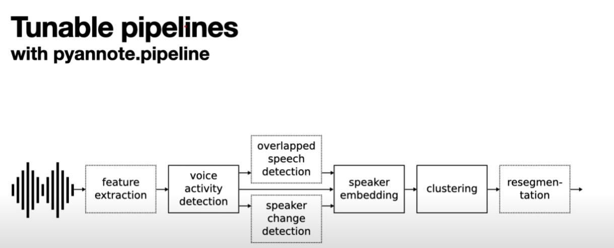

# DT2119-Project

### Project goal
The goal of the project is two compare two speaker diarization pipelines, one pre-trained pipeline from the pyannote library on raw audio data and the other pipeline with custom speaker embeddings with d-vectors and spectral clustering. 

**What is PyAnnote?**
Based on PyTorch ML framework it provides a set of trainable end-to-end neural building blocks that 
can be combined and jointy optimized to build speaker diarization pipelines.

**What is speaker diarization?**
The task of partitioning the audio stream into homogenous temporal segments according to the identity of the speaker. 
- INPUT -> The audio file
- OUTPUt -> Who speaks when?

Pyannote comes with pretrained models for voice activity detection, speaker change detection, overlapped speech detection and speaker embedding.
Inline-style: 

[Linkt to spectral cluster](https://github.com/wq2012/SpectralCluster)
[Further reading](https://github.com/wq2012/awesome-diarization)
